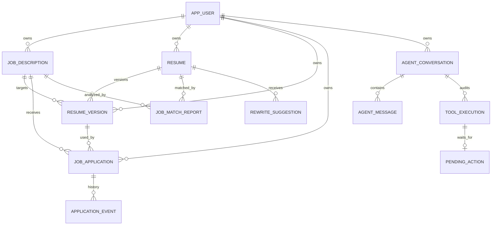

# CareerAgent 数据库设计

项目使用 PostgreSQL 16 与 Flyway 管理数据表。唯一迁移入口为后端的 `src/main/resources/db/migration`，应用启动时自动执行尚未应用的迁移。V1 创建核心表，V2 增加枚举约束，V3 增加 Agent 记录，V4 增加 AI 分析结果，V5 增加按用户隔离的模型配置与加密 API Key 字段，V6 增加官网源及外部岗位标识，V7 将其规范为 `source_job_id` 并加入字节来源及跨来源唯一索引。

官网岗位通过 `(user_id, source_config_id, external_job_id)` 部分唯一索引去重。成功同步后，仍在公开 API 中的岗位更新 `last_verified_at` 并保持 `OPEN`；已从该来源消失的岗位标记为 `CLOSED`，不会再出现在默认岗位雷达中。

## 实体关系

数据库表为 `app_user`、`job_description`、`resume`、`resume_version`、`job_application` 和 `application_event`。字段使用 snake_case，Java 属性使用 camelCase；主键统一为 `BIGSERIAL`/`Long`，时间使用带时区的 `TIMESTAMPTZ`。

## 关键建模决策

Resume 保存用户持续维护的基础简历。ResumeVersion 保存某次面向岗位的完整简历快照，而不是修改差异，因此基础简历后续变化不会破坏历史投递材料的可还原性。

Application 必须绑定 ResumeVersion，而不是直接绑定 Resume。这样每条投递都能准确回答“当时使用了哪一版简历”。岗位和版本均使用外键与删除限制保护历史事实。

ApplicationEvent 单独记录状态历史。Application 状态更新与 Event 写入处于同一事务，避免只保留当前状态而丢失过程。事件按 `created_at` 和主键升序返回。

## JSONB

岗位的职责、技能、关键词、关注点和面试主题，以及简历的教育、经历、项目、技能和版本完整快照使用 JSONB。它们是结构化、可演进的数据，不被降级为转义后的普通字符串。Java 侧通过 `PostgresJsonbTypeHandler` 完成对象与 JSONB 的转换。

## Agent 执行记录

`agent_conversation` 与 `agent_message` 保存可恢复的会话历史；`tool_execution` 保存工具输入、输出、状态、错误与耗时；`pending_action` 保存需要人工确认的写操作。待确认操作设置过期时间，且 `tool_execution_id` 唯一。确认与拒绝通过 `SELECT ... FOR UPDATE` 串行处理，避免重复写入。

`job_match_report` 保存匹配分、匹配/缺失技能、修改建议和逐条 evidence。`rewrite_suggestion` 保存原文、建议文本、待确认事实、警告及审核状态；它不覆盖 Resume。重新生成保留旧记录并将其标记为 `SUPERSEDED`。

## 开发数据

V1 初始化一个固定开发用户 `demo`（ID 1）、两个示例岗位和一份默认基础简历。`CurrentUserProvider` 在 dev profile 下集中返回用户 1，业务 Service 不直接硬编码用户 ID。
